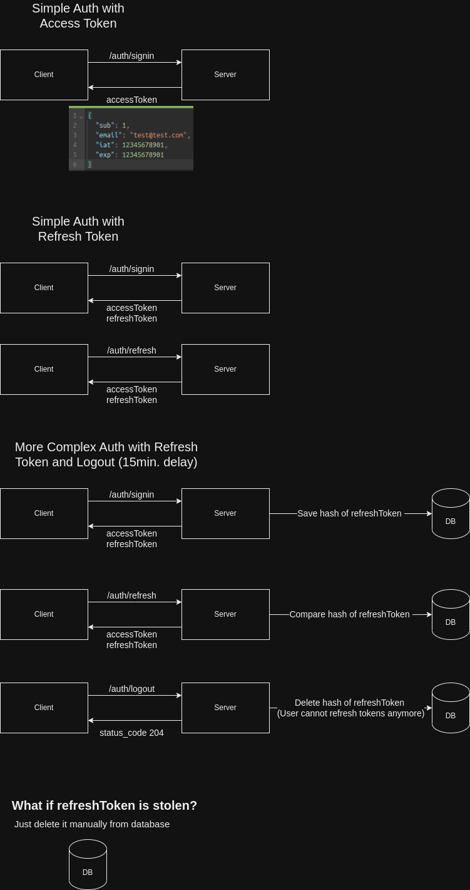

# Authentication API - NestJS + PostgreSQL


## Table of Contents:

🎯 [Objective](#-objective)  
🏃 [Running the project](#-running-the-project)  
📄 [Scripts](#-scripts)  
📚 [API Documentation](#-api-documentation)  
🚧 [Troubleshooting](#-troubleshooting)


---


## 🎯 Objective

The main objective of this project is to create a simple authentication API to understand the use of JWT tokens, refresh tokens and role based authorization with Bearer Token Authentication strategy. It was built with [`NestJS`](https://nestjs.com/) and [`PostgreSQL`](https://www.postgresql.org/).

For more details, check the [**📚 API Documentation**](#-api-documentation) section.

[**Here**](https://www.linkedin.com/posts/william-rodrigues-dev_github-willy-rauthentication-api-simple-activity-7087053399656980480-ksU4?utm_source=share&utm_medium=member_desktop) you can find a Linkedin post explaining more about why to use Bearer Token with JWT in a Authentication System.

<details>
  <summary><b>Functionality diagram</b1></summary>
  
</details>


## 🏃 Running the project

You should have a **Docker** environment with support to **Docker Compose V2**.

> ⚠️ _This project uses bash scripts to make some commands easier to run and was tested only on a Linux machine. If you are using Windows, I highly recommend you running this project inside a WSL2 distro, or using Git Bash as your terminal._

Open your terminal in the root folder and type:

```bash
sh ./scripts/run.sh
```

This script will make sure to build your images and in subsequent runs, it will skip the installation step and directly start all containers.

To stop running containers, just type:

```bash
sh ./scripts/stop.sh
```

and all your containers will be dropped and volumes will be removed.


## 📄 Scripts

Beyond `run.sh` and `stop.sh`, we have other helper scripts:

- `run-db.sh`: Run only database specific containers, when you want to run the application without Docker


## 📚 API Documentation

After running the server, an enteractive documetation with [`Swagger`](https://swagger.io/) will be available at [`localhost:3000/docs`](http://localhost:3000/docs)

You can also execute a command to seed the database with users to use with API endpoints:
```bash
pnpm prisma db seed
```

> ⚠️ After that two users will be available for authentication:
>
> - **Admin User** Email: admin@admin.com; Password: admin123
> - **Regular User** Email: user@user.com; Password: user123


## 🚧 Troubleshooting

- Make sure you have these ports available before running the project:
  - **`3000`**: Used by Nest API
- Make sure your Docker daemon is running!
- Make sure you are using a newer version of Docker that supports Docker Compose V2! **This project does not use `docker-compose`** (a.k.a. V1) because this version will no longer be supported from the end of June 2023.
- If you are somehow receiving `Permission denied` when trying to run any scripts, run
  ```sh
  chmod +x ./*.sh && chmod +x ./docker/*.sh
  ```
  to make sure your terminal can execute utility scripts.
